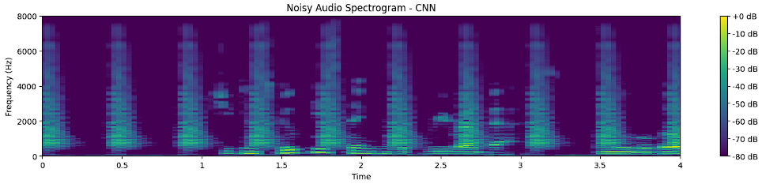
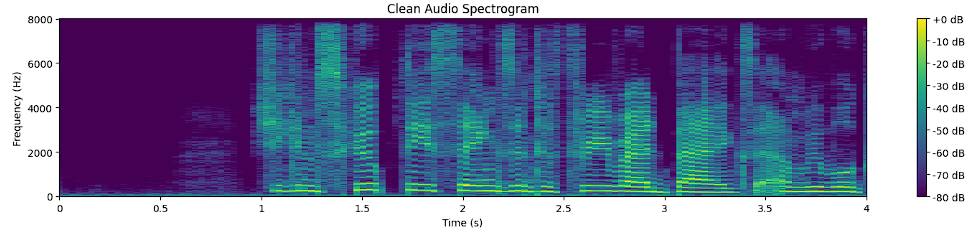

# Transient-Noise_Reduction

This repository contains Jupyter notebooks and supplementary materials for **transient noise reduction** in speech signals. The primary goal is to **compare different neural network architectures**—specifically **Feed-Forward Neural Networks (FNN/MLP)**, **Convolutional Neural Networks (CNN)**, and **Recurrent Neural Networks (RNN/LSTM)**—to determine their effectiveness in suppressing transient (sudden, short-duration) noise.

The project leverages:

1. **Three Jupyter Notebooks** (one each for FNN, CNN, and RNN).
2. A **research paper** (PDF) that presents the methodology, experiment design, results, and conclusions.
3. A **PowerPoint presentation** summarizing key findings.

---

## Table of Contents
- [Overview](#overview)
- [Project Structure](#project-structure)
- [Methodology](#methodology)
  - [Dataset](#dataset)
  - [Data Preprocessing](#data-preprocessing)
  - [Models](#models)
  - [Training and Evaluation](#training-and-evaluation)
- [Usage Instructions](#usage-instructions)
  - [Environment Setup](#environment-setup)
  - [Running the Notebooks](#running-the-notebooks)
- [Results](#results)
  - [Audio](#audio)
  - [Mask](#mask)
  - [Spectrogram](#spectrogram)
- [Future Work](#future-work)
- [References](#references)
- [Contact](#contact)

---

## Overview

**Transient noise** (e.g., door slams, claps, coughs, clicks) can severely degrade speech quality and intelligibility, especially in devices like hearing aids, where consistent speech enhancement is crucial. Traditional noise reduction methods (e.g., Automatic Gain Control) struggle to handle abrupt, unpredictable noises without distorting speech.

This project explores **three deep neural network (DNN) approaches** to mitigating transient noise:

1. **Multi-Layer Perceptron / Feed-Forward Network (FNN/MLP)**
2. **Convolutional Neural Network (CNN)**
3. **Recurrent Neural Network (RNN) with LSTM units**

Each approach is trained and tested on **speech samples artificially corrupted with transient noise** under varying signal-to-noise ratios (SNRs). We evaluate performance based on:
- **Signal-to-Noise Ratio (SNR) Improvement**
- **Mean Squared Error (MSE)**
- **Perceptual Evaluation of Speech Quality (PESQ)**
- **Short-Time Objective Intelligibility (STOI)**

---

## Project Structure


- **FNN_Transient_Noise.ipynb**: Implements a Multi-Layer Perceptron (MLP) architecture for transient noise reduction.
- **CNN_Transient_Noise.ipynb**: Implements a Convolutional Neural Network approach.
- **RNN_Transient_Noise.ipynb**: Implements an LSTM-based Recurrent Neural Network approach.
- **Transient Noise Reduction.pdf**: Full paper with methodology and results.
- **Transient Noise Reduction.pptx**: Slide deck summarizing the approach and findings.

---

## Methodology

### Dataset

- **Primary Speech Data**: [CSTR VCTK Corpus](https://datashare.ed.ac.uk/handle/10283/3443).  
  - Contains recordings of over 100 speakers with varied accents.
  - Sample rate of 48 kHz (down-sampled to 16 kHz in our experiments).
- **Transient Noise Samples**: We use 10 short-duration noises (e.g., claps, crashes, sirens) mixed at multiple SNR levels: **-5 dB, 0 dB, +5 dB**.

### Data Preprocessing

1. **Resampling** to 16 kHz (or the desired rate).
2. **Mel Spectrogram** transformation:
   - 64 Mel frequency bins
   - FFT size of 1024
   - Hop length of 512
3. **Augmentation**: Each clean speech file is merged with one of the transient noises at the chosen SNR, producing noisy speech.  
4. **Train / Validation / Test Splits**: 
   - ~80% training, ~10% validation, ~10% testing.
   - Ensures speakers in the test set do not appear in training or validation (speaker-level separation).

### Models

1. **FNN (Feed-Forward / MLP)**  
   - Several fully connected layers with ReLU (or similar) activation.  
   - Output layer predicts either the enhanced audio directly or an **Ideal Ratio Mask (IRM)**.

2. **CNN (Convolutional Neural Network)**  
   - Convolutional layers (e.g., 3×3 kernels) to capture local time-frequency features in the Mel spectrogram.  
   - Final convolution or dense layer to predict the IRM or clean spectrogram.

3. **RNN (Recurrent Neural Network with LSTM)**  
   - LSTM layers to capture time dependencies in sequential speech frames.  
   - Particularly effective for transient, sudden noises because they can leverage memory across time steps.

### Training and Evaluation

- **Loss Function**: Typically **MSE** between predicted and target clean spectrogram (or IRM).  
- **Optimizer**: [Adam](https://arxiv.org/abs/1412.6980) with a learning rate of 0.001.  
- **Number of Epochs**: ~5–50 (depending on model complexity and early stopping criteria).  
- **Batch Size**: 32 or 64, depending on GPU memory constraints.  

**Evaluation Metrics** include:
1. **SNR Improvement** (how many dB of noise are reduced)
2. **Mean Squared Error (MSE)** (lower is better, indicates closeness to clean signal)
3. **PESQ** (predicts perceived quality; ranges ~-0.5 to 4.5)
4. **STOI** (range 0 to 1, measures objective intelligibility)

---

## Usage Instructions

### Environment Setup

1. **Clone this repository**:
   ```bash
   git clone https://github.com/YourUsername/TransientNoiseReduction.git
   cd TransientNoiseReduction

2. **Create a Conda/virtual environment (optional but recommended)**:
   ```bash
   conda create -n noise_reduction python=3.9 -y
   conda activate noise_reduction

3. **Install dependencies**:
   ```bash
   pip install numpy scipy librosa jupyter torch torchaudio torchvision

1. **Running the Notebooks**:
   ```bash
   jupyter notebook
---
## Running the Notebooks

Then navigate to each of the following notebooks to run them:

- **FNN_Transient_Noise.ipynb**  
  *Explores the feed-forward approach.*

- **CNN_Transient_Noise.ipynb**  
  *Explores the convolutional approach.*

- **RNN_Transient_Noise.ipynb**  
  *Explores LSTM-based recurrent approach.*

Each notebook typically follows this structure:
1. **Data Loading and Preprocessing**
2. **Model Definition**
3. **Training** (may take time depending on dataset and GPU availability)
4. **Evaluation** of test samples (prints MSE, SNR improvement, PESQ, STOI, etc.)

---

## Results

Below is a high-level snapshot of the final results (aggregated from the paper and slides):

| **Model** | **SNR Improvement (dB)** | **MSE (×10^-2)** | **PESQ** | **STOI** |
|:--------:|:-------------------------:|:----------------:|:--------:|:--------:|
| **FNN**   | ~0.37                    | 0.50–0.62        | 1.19     | 0.57     |
| **CNN**   | ~0.26                    | 0.61–0.62        | 1.15     | 0.49     |
| **RNN**   | ~0.58                    | 0.40–0.41        | 1.14     | 0.58     |

- **RNN** often provides the best SNR improvement and competitive MSE while keeping reasonable inference speed and memory usage.  
- **FNN** trains quickly and can achieve good speech quality metrics, but can have higher inference time and memory usage.  
- **CNN** can capture local patterns in time-frequency representations but can struggle with truly unpredictable transients compared to RNN.

### Audio

1. **Original Noisy Audio**
<audio controls>
  <source src="audio/Original_Noisy_Audio.webm" type="audio/webm">
  Your browser does not support the audio element.
</audio>


2. **Enhanced Audio**  
<audio controls>
  <source src="audio/Enhanced_Audio.webm" type="audio/webm">
  Your browser does not support the audio element.
</audio>

3. **Clean Audio**  
<audio controls>
  <source src="audio/Clean_Audio.webm" type="audio/webm">
  Your browser does not support the audio element.
</audio>

### Mask

#### CNN


#### RNN


#### MLP


---

### Spectrogram

#### CNN




#### RNN


#### MLP



---

## Future Work

1. **Expanded Noise Types and Accents**  
   Include more transient noises (e.g., gunshots, plate breaking, etc.) and broader speech accents to ensure robust real-world deployment.

2. **Architectural Optimization**  
   Refine existing FNN, CNN, and RNN architectures or explore pruning, quantization, and other optimization techniques to reduce memory and computational cost without sacrificing performance.

3. **Hybrid Architectures**  
   Investigate combined models that merge CNN feature extraction with RNN temporal modeling or FNN layers to enhance both local feature capture and long-term sequence understanding.

4. **Real-Time Applications**  
   Evaluate on hardware-constrained devices (like hearing aids or embedded systems) for on-the-fly noise reduction, testing both latency and energy consumption.

5. **Clinical Studies**  
   Conduct user-centric evaluations and formal listening tests to confirm gains in speech intelligibility and user comfort, particularly for hearing-impaired listeners.

---

## References

- **Transient Noise Reduction (PDF)** – Full paper with detailed methodology, theoretical foundations, and experimental results.  
- **Transient Noise Reduction (PPT)** – Slide deck summarizing architecture, training process, and outcome.  
- *Keshavarzi, M. et al. **Use of a Deep Recurrent Neural Network to Reduce Wind Noise: Effects on Judged Speech Intelligibility and Sound Quality.** Trends in Hearing, 2018.*  
- **VCTK Dataset**: [Official Link](https://datashare.ed.ac.uk/handle/10283/3443)

---

## Contact

For questions or feedback:

- **Name**: *Muqaddaspreet Singh Bhatia*
- **Email**: *(muqaddaspreetsb@gmail.com)*
- **GitHub**: [Muqaddaspreet](https://github.com/Muqaddaspreet)

If you use or extend this work, please cite this repository and consider referencing the accompanying paper.
